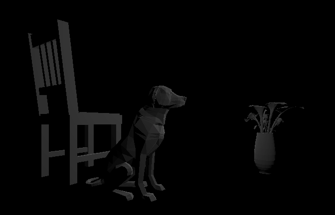
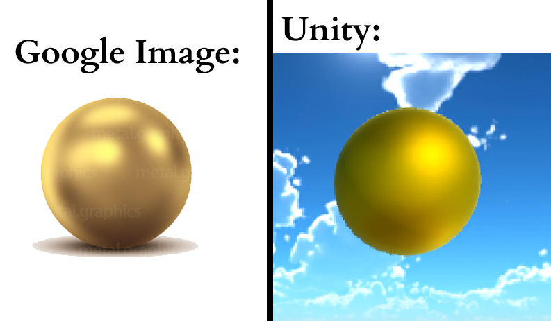

# CMPM163Labs

## lab 2 ##
video: https://drive.google.com/file/d/17jfkKoHkQXqcE-02sG0wZYWiwN76UaPN/view?usp=sharing

## lab 3 ##
video: https://drive.google.com/file/d/1ohHOBMqkH0mxcK_fUP-TfkpE43qwgZdQ/view?usp=sharing

Cube Material From Left to Right:

1) Used the THREE.MeshBasicMaterial function with the color set to orange and wireframe enabled

2) Used the THREE.MeshPhongMaterial function with color as gray, specular as green, and shininess as 30

3) Used a matrial with a simple vertex and fragment shader. The vertex shader maintained the position of the vertices on the mesh. The fragment shader returns the interpolation of two colors(used two different blueish colors) based on the z-coordinate of the fragment. Specifically, interpolation was done using the mix() function.

4) Used a material with the same vertex shader in cube 3 and a different fragment shader output. For this cube, the fragment shader would output a color for the fragment based on its position. The fragment's x-coordinate was used for the value of red, y-coordinate for the value of green, and z-coordinate for the value of blue.

## lab 4 ##
video: https://drive.google.com/file/d/1zWtMgJdBW8OuczLAlTpcwrekAo9OnN7E/view?usp=sharing

Answers to Questions:

24a) 7u

24b) 7(1-v)

24c) gray

How I Made Each Cube:

1) Bottom Left: The material is a THREE.MeshPhongMaterial() material with a map set to the texture loaded from "156.jpg". Used the built-in three.js texture function to load in the texture.

2) Bottom Middle: The material is a THREE.MeshPhongMaterial() material with a map set to the texture loaded from "156.jpg" and a normalMap set to the texture loaded from "156_norm.jpg". Used the built-in three.js texture function to load in the textures.

3) Top Middle: The material is a THREE.MeshPhongMaterial() material with a map set to the texture loaded from "161b.jpg" and a normalMap set to the texture loaded from "161_norm.jpg". Used the built-in three.js texture function to load in the textures.

4) Bottom Right: The material was made by using a custom fragement and vertex shader, which were provided in the assignment. The vertex shader passes the uv coordinates to the fragment shader. The fragment shaders takes in a given texture and uses a 1 to 1 mapping with the uv coordinates to place it on the cube.

5) Top Right: The material was made using the same vertex shader, but different fragment shader. The fragment shader still takes a given texture and places it on a cube, but the mapping is diffferent. It'll take the uv coordinates provided by the fragment shader and multiply them by 2. If the u-coordinate is greater than 1 afterwards, I subtract 1 from that value. If the v-coordinate is greater than 1, I subtract 1 from that value. 

## lab 5 ##
video: https://drive.google.com/file/d/1eHaV6AhWekxN6sWczj-CUHcQ4H0t-xA_/view?usp=sharing

(Note: particles were done by following tutorial, but values might be different for certain variables)

Changes: 
- changed player model by replacing the material on the Skinned Mesh Renderer to a basic green one
- replaced the skybox material on the camera with a basic one I made using the Skybox/Procedural material option
- made the road orange by changing the mesh renderer on each road object to have a basic orange material
- increased the intensity on ambient occlusion in the postprocessvolume gameObject

## lab 6 ##
Image of Scene: https://drive.google.com/file/d/1kcIad1mVZ5PLCDTp-SFCd-g7a_7OmNIW/view?usp=sharing

Image of Material Comparison: https://drive.google.com/file/d/1g_llotp5eeLY-CzylmNkMlw-pPQm_Hs2/view?usp=sharing

Light Definitions:
- Point Light illuminates the scene based on the light’s position in the scene. It shines equally in all directions, so rotation of the object has no influence.
- Directional Light effects all objects in the scene, lighting them based on the direction of the light determined by the game object’s rotation. The position of the light has no influence.
- Spotlight points in a direction based on the rotation of their game object and illuminate all objects within a cone. They are influenced by both the rotation and position of their game object
- Area Light shines in all directions to one side of a rectangular plane. These only work when baking a light map.

Gold Material:
I tried making a golden metal material by changing the albedo color to orangish-yellow, metallic value to 1, and smoothened value to 0.348. I also had to add a reflection prob in order to get the metal effect to appear in the scene.

Textures: I used one brick texture and one rocky texture

Skybox: I added a cloudy morning skybox.

## lab 7 ##
I chose to do Part 1.

Video: https://drive.google.com/file/d/1IoulDedBf6Dlrp6KYcwt53-3ohvC-IYU/view?usp=sharing

How I made the scene:
- The snow capped mountains were made by using the shader from the first given tutorial. However, I changed the shader so that the voronoi noise node only uses the x and z values of the position as an input. I also added a dirt texture to the mountain by placing a 2D texture node into the last node of the shader graph. I tried to make the mountains look snow capped by doing some math with a white texture and the dirt texture. I'd see if the y-value for the final position vector is greater than 7. If it is, then I'd add the white texture to the dirt texture.
- The wave was directly taken from the second tutorial and nothing significant was added.
- I added a skybox and various 3D models I downloaded for free on the asset store.

I tried to message my partner on Discord to answer the final 3 questions to gether, but they never replied to me.

## lab 8 ##
I chose to do Part 1.

Inspiration Image: https://drive.google.com/file/d/1UJih4iBRiJ6Z4XsHiOW5ZvawMm849ZfO/view?usp=sharing

Resulting Image: https://drive.google.com/file/d/1v-uXWooPCBhm_yyYdp0I4KHu2E-2n-cY/view?usp=sharing

Explination:
The city of inspiration got me to change the building layout and arrangement of the tutorial. I tried to imitate the city by copying the general structure of each tower-like mass of buildings. I'm not sure what these are called, so I'll just call them towers. Each tower is made up of many small houses that stack up on each other to form the general shape of a cone. The arrangement of houses are roughly the same, but each individual house is random. At the top of each tower, there is a structure larger than the size of the houses. I didn't get many free assets, so I combined various building prefabs to create three different structures that are supposed to imitate these larger structures.

I tried to message my partner on Discord to answer the final 3 questions to gether, but they never replied to me.
